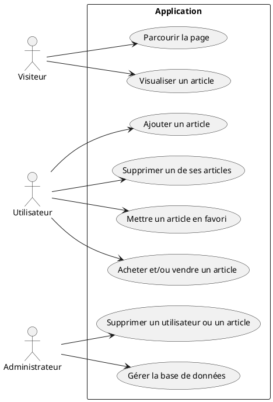
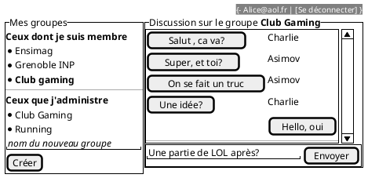

---
title: Projet React 
author:  
- A compléter avec vos noms
--- 

## Cahier des charges

Ici vous décrivez les fonctionnalités souhaitées et celles effectivement mises en oeuvre. Avec un diagramme UML des cas d'usage et des maquettes des vues souhaitées et des captures d'écran de ce qui a été réalisé.

### Cas d'usage

Nous avons le cas d'usage suivant : 



### Maquettes

A modifier/compléter...



### Captures d'écran

A compléter

### API mise en place

Donner le lien vers la documentation swagger et/ou faire un tableau récapitulant l'API

A compléter

## Architecture du code

### FrontEnd

Le code source du frontend est divisé en 4 dossiers principals
- Components : Dans ce dossier, nous avons 5 fichiers portant les noms : Bouton.jsx, Categorie.jsx, Formulaire.jsx, NavigationBar.jsx et SearchBar.jsx :  
    1) Les fichiers Bouton.jsx, SearchBar.jsx et Categorie.jsx contiennent des définitions de styles CSS utilisées pour styliser différents composants de notre application web,  tels que la barre de recherche, les boutons et la barre de navigation. Ils sont importés dans les composants correspondants pour appliquer ces styles et personnaliser l'apparence de l'application.
    2) Le fichier NavigationBar.jsx est un composant React qui représente la barre de navigation de notre application web. Ce composant est responsable de l'affichage de différents éléments de navigation et de formulaires de connexion, d'inscription et de modification.  Le composant NavigationBar est une fonction React qui rend la barre de navigation de l'application. Il utilise plusieurs états (useState) pour suivre l'état des formulaires de connexion, d'inscription et de modification, ainsi que d'autres états pour gérer l'affichage des sous-catégories dans la barre de navigation. Le composant utilise des fonctions pour gérer les événements tels que le changement de taille de la fenêtre (handleResize) et le changement de sélection dans les menus déroulants (handleSelectChange). Il utilise également des fonctions pour afficher et masquer les formulaires de connexion, d'inscription et de modification en fonction des actions de l'utilisateur (toggleLoginForm, toggleRegistrationForm, toggleModificationForm).  Le composant utilise des conditions pour afficher certains éléments en fonction de l'état actuel de l'application. Par exemple, il affiche les boutons de connexion et d'inscription si l'utilisateur n'est pas connecté, et affiche le menu déroulant du compte utilisateur s'il est connecté.  Le composant affiche des options de catégorie dans la barre de navigation, avec des sous-catégories qui apparaissent lorsque l'utilisateur survole une catégorie spécifique. Ces sous-catégories sont affichées sous forme de menus déroulants. Le composant rend également les formulaires de connexion, d'inscription et de modification lorsqu'ils sont activés via des actions utilisateur.
    3) Le fichier formulaire.jsx contient plusieurs composants de formulaire utilisés dans l'application.  Un formulaire pour la connexion des utilisateurs. Il permet de saisir l'email et le mot de passe, puis envoie les données à l'API pour l'authentification(FormulaireConnexion). Un formulaire pour l'inscription des nouveaux utilisateurs. Il comprend des champs pour le nom, l'email, le mot de passe et une image de profil, et envoie les données à l'API pour créer un nouveau compte utilisateur(FormulaireInscription). Un formulaire pour modifier les informations utilisateur existantes. Il permet de modifier le nom, l'email et le mot de passe, et envoie les modifications à l'API pour mettre à jour les informations utilisateur (FormulaireModification).  Un formulaire pour ajouter un nouvel article. Il comprend des champs pour le titre, la description, le prix et une image de l'article, et envoie les données à l'API pour créer un nouvel article (FormulaireAjoutPost). Un formulaire pour modifier un article existant. Il récupère les détails de l'article sélectionné et permet à l'utilisateur de modifier le titre, la description, le prix et l'image de l'article, puis envoie les modifications à l'API pour mettre à jour l'article (FormulaireModifierPost). Un composant de confirmation pour la suppression d'un article. Il permet à l'utilisateur de confirmer ou d'annuler la suppression de l'article (FormulaireSuppressionPost).  Un formulaire pour soumettre une offre sur un article. Il contient un champ pour saisir le montant de l'offre, puis envoie les données à l'API pour soumettre l'offre (FormulaireOffre).

    Chaque composant utilise des hooks d'état pour gérer les données des formulaires et des fonctions de rappel pour gérer les événements de soumission et de fermeture des formulaires. Les données sont envoyées à des endpoints de l'API à l'aide de la fonction fetch pour effectuer différentes actions telles que la connexion, l'inscription, la modification et la suppression d'articles.
- Design : il  est comoosé de 3 fichier : CarteHabits.jsx, NativeBar.jsx et Navbar.jsx. Ces fichiers sont utilisés pour styliser différents composants de l'application. Ils incluent des styles pour les cartes d'articles, les images, les prix, les utilisateurs, les barres de recherche, et les barres de navigation. Chaque style spécifie des propriétés telles que la taille, la couleur, la bordure, et la disposition des éléments. Ces styles contribuent à l'apparence globale de l'application et à l'expérience utilisateur.
- img : dans ce dossier,, nous avons une partie des icones et des images utilisées dans le site. 
- Pages : Elle regroupe toutes les pages accessibles a partir des liens et boutons du sites. Les pages sont : la page accueil, article, Messagerie, Recharge, la page des articles de l'utilisateur et la page des favoris de l'utilisateur. 
    1) accueil.jsx : Il utilise React pour créer des composants dynamiques. La fonction PagePrincipale utilise des états pour stocker les données des articles, les filtres de tri, et l'état des favoris. Elle effectue des requêtes HTTP pour récupérer les données des articles et des favoris depuis une API, puis les affiche dans des cartes stylisées. Les utilisateurs peuvent trier les articles par prix croissant ou décroissant à l'aide d'une liste déroulante. Ils peuvent également ajouter ou supprimer des articles de leurs favoris en cliquant sur une icône de cœur.
    2) article.jsx : il représente la page d'un article de notre application. On utilise React pour créer des composants dynamiques.  La fonction PageArticle récupère les détails de l'article à partir de l'API en fonction de l'ID passé dans l'URL. Une fois les données récupérées, elle affiche le titre, la description, le prix et les images de l'article. Les utilisateurs peuvent acheter l'article, envoyer un message au vendeur ou faire une offre sur l'article. Lorsque l'utilisateur clique sur une image de l'article, elle s'agrandit pour une meilleure visualisation. L'utilisateur peut également faire une offre sur l'article en cliquant sur un bouton, ce qui fait apparaître un formulaire de soumission d'offre. Enfin, l'utilisateur peut fermer l'image agrandie en cliquant sur un bouton de fermeture. Le code utilise des états pour gérer l'affichage de l'image agrandie, le formulaire d'offre, ainsi que pour stocker les détails de l'article et l'ID de l'article actuellement affiché.
    3) Messagerie.jsx : représente la page de messagerie de notre application web. Il utilise React pour créer des composants interactifs. La fonction Messagerie crée un composant de messagerie qui permet à l'utilisateur d'afficher l'historique des messages et d'envoyer de nouveaux messages. 
    4) Recharge.jsx : représente la page de recharge de compte de notre application web. Il utilise React pour créer des composants interactifs.La fonction RechargePage crée un composant qui permet à l'utilisateur de recharger son compte en ajoutant un montant spécifié. Le composant utilise deux états : montantBase pour stocker le montant de base du compte et montantAjoute pour stocker le montant à ajouter. Lorsque l'utilisateur entre un montant à ajouter et appuie sur le bouton "Recharger", la fonction handleRecharge est appelée pour mettre à jour le solde du compte. Si le montant ajouté est supérieur à zéro, le montant de base est mis à jour avec le montant ajouté, sinon un message d'erreur est affiché. Le code affiche le montant de base et le montant ajouté, ainsi qu'un champ de saisie pour entrer le montant à ajouter et un bouton "Recharger".
    5) userArticles.jsx : cette page permet à l'utilisateur de voir ses articles, d'en ajouter de nouveaux, de les modifier ou de les supprimer.
    6) userFavorites.jsx : cette page permet à l'utilisateur de voir ses articles favoris et de les supprimer de sa liste de favoris.
- App.jsx :  ce fichier définit la structure et le comportement de base de votre application React, en utilisant le routage pour gérer la navigation entre les différentes pages. Il importe plusieurs composants et bibliothèques, notamment react-router-dom pour la navigation dans l'application. Le composant App est défini, qui représente le point d'entrée de l'application. Il utilise le hook useState pour gérer l'état userInfo, qui stocke les informations sur l'utilisateur. Le hook useEffect est utilisé pour récupérer les données userInfo depuis le stockage local lors du montage du composant. La fonction localStorage.getItem('userInfo') est utilisée pour récupérer les informations utilisateur stockées localement. Les données utilisateur récupérées sont stockées dans l'état userInfo. Le composant BrowserRouter est utilisé pour encapsuler les routes de l'application. Les différentes routes sont définies à l'aide du composant Route, qui associe un chemin URL à un composant à afficher. Chaque route est associée à un composant spécifique à afficher lorsque l'URL correspond à cette route. Les routes comprennent la page d'accueil (PagePrincipale), la page d'article (PageArticle), la page des articles de l'utilisateur (PageArticleUtilisateur), la page des favoris de l'utilisateur (PageFavoriUtilisateur), la messagerie (Messagerie), et la page de recharge (RechargePage).
### Backend

#### Schéma de votre base de donnée

A modifier/compléter...

```plantuml
class User{
  id
  profilePic
  name
  email
  passhash
  solde
  isAdmin : boolean
}

class Message{
  id
  content
  gid
  uid
}

class Group{
  id
  name
  ownerId
}

class Post{
  id
  postImage
  title
  description
  price
  ownerId
}

class Favorite{
  memberId
  postId
}

class Offre{
  id
  postId
  userId
  price
  status
}

class Category{
  id
  name
}

User "1" -- "n" Message : posts
Group "1" -- "n" Message : contains

User "n" -- "n"  Group : is member 
User "1" -- "n"  Group : create and own

Post "1" -- "n" Favorite : has
Post "1" -- "n" Offre : has
Post "1" -- "n" Category : is

User "1" -- "n" Post : posts
```

#### Architecture de votre code

Pour l'organisation de notre code, nous avons utilisé l'architecture basée sur le modèle MVC (Modèle-Vue-Contrôleur) pour le backend. Voici comment le code est organisé :

Modèles : Les modèles représentent la structure des données de notre application. Chaque modèle correspond à une table dans notre base de données. Dans notre cas, nous avons des modèles pour les utilisateurs, les messages, les groupes, les articles (posts), les favoris, les offres et les catégories.

Contrôleurs : Les contrôleurs sont responsables de la logique métier de notre application. Ils traitent les requêtes entrantes, interagissent avec les modèles pour récupérer ou manipuler les données, et renvoient les réponses appropriées. Nous avons des contrôleurs pour gérer les utilisateurs, les messages, les groupes, les articles, les favoris et les offres.

Routes : Les routes définissent les points de terminaison de notre API et associent chaque point de terminaison à un contrôleur spécifique.

Relations 1-n :
Une seule instance d'une entité est associée à plusieurs instances d'une autre entitée. Par exemple un utilisateur peut avoir plusieurs messages (1-n relation entre User et Message) ou plusieurs articles (1-n relation entre User et Post). De même, un groupe peut contenir plusieurs messages (1-n relation entre Group et Message).

Relations n-n :
Plusieurs instances d'une entité sont associées à plusieurs instances d'une autre entité. Par exemple, plusieurs utilisateurs peuvent appartenir à plusieurs groupes (n-n relation entre User et Group). De mếme, plusieurs articles peuvent ếtre ajoutés aux favoris de plusieurs utilisateurs (n-n relation entre Post et User).

Ces relations sont gérées à l'aide de clés étrangères dans la base de données et sont traduites par des associations entre les différents modèles. Les relations 1-n sont généralement représentées par des associations directes entre les modèles, tandis que les relations plusieurs-à-plusieurs nécessitent souvent l'utilisation d'une table de liaison (table de jointure) pour établir l'association entre les entités.


### Gestion des rôles et droits

- Coté backend
Ces droits définissent les autorisations et les actions possibles pour chaque endpoint de l'API. Nous avons les admininstrateurs et les vendeurs/acheteur qui sont tous les deux des users.
Dés le début du  projet, nous avons défini un fichier pour gérer les droits d'accés. Nous expliquons le fichier ci-dessous et mettrons une capture d'écran dans le dossier capture d'écran

    1) Endpoint /api/myitems
          - GET: Permet de lister les annonces créées et gérées par l'utilisateur.
          - POST: Autorise l'utilisateur à créer une annonce. Les informations associées à cette annonce sont le titre, la description, le prix, la catégorie et l'image.

    2) Endpoint /api/myitems/{id}
          - PUT: Autorise la mise à jour des informations concernant une annonce spécifique identifiée par son ID. Les informations pouvant être mises à jour sont le titre, la description, le prix et la catégorie.

    3) Endpoint /api/items
          - GET: Permet de lister toutes les annonces du site.

    4) Endpoint /api/items/{id}
          - GET: Fournit les attributs de l'article identifié par son ID.
          - DELETE: Permet à l'utilisateur de supprimer l'une de ses propres annonces ou à l'administrateur de bannir une annonce.

    5) Endpoint /api/items/{id}/offers
          - GET: Liste les offres faites pour un article spécifique identifié par son ID.
          - POST: Permet à l'utilisateur de créer une offre pour l'article identifié par son ID. La donnée requise est le prix de l'offre.

    6) Endpoint /api/items/{id}/favorites

    7) Endpoint /api/myfavorites
          - GET: Liste les annonces favorites de l'utilisateur.

    8) Endpoint /api/myfavorites/{iid}
          - POST: Permet à l'utilisateur d'ajouter une annonce en tant que favori.
          - DELETE: Permet à l'utilisateur de supprimer une annonce de ses favoris.

    9) Endpoint /api/categories
          - GET: Liste toutes les catégories.
          - POST: Permet à l'administrateur d'ajouter une catégorie avec un nom spécifié.

    10) Endpoint /api/categories/{cid}
          - GET: Liste tous les articles appartenant à une certaine catégorie identifiée par son ID.
          - DELETE: Permet à l'administrateur de supprimer une catégorie.

    11) Endpoint /api/myoffers
          - GET: Liste les offres de l'utilisateur.
          - PUT: Permet à l'utilisateur d'accepter ou de refuser une offre spécifique identifiée par son ID.
          - DELETE: Permet à l'utilisateur d'annuler une offre spécifique identifiée par son ID.


- Coté frontend
 Pour avoir accés à sa liste de favoris, envoyer des messages et proposer des offres, il faudrait au préalable se connecter à son compte ou s'inscrire.

## Test

### Backend

Décrivez les tests faits au niveau du backend, leur couverture.

### Frontend
Pour les tests du frontend, nous avons fait des tests pour chaque fonctionnalités, chaque boutons et chaque vu.
- Page Accueil 
    1) A l'entrée, le logo vinted marche en nous ramenant à la page d'accueil 
    2) La  barre de recherche est fonctionnelle et permet de faire la recherche des articles
    3) En cliquant sur un article, nous atterissons sur la page de l'article page sur laquelle nous pouvons envoyer un message, faire une offre mettre en favoris également ou acheter. Sur cette page artcle, nous pouvons zoomer sur l'article en cliquant dessus. 
    4) sur la barre de recherche, nous avons egalement les boutons connexion, deconnection et les boutons pour selectionner utilisateurs ou articles
    5) Les catégories femmes, enfants, hommmes... permettent de faire des filtres et de voir les articles correspondants 
  
- Formulaire connexion / deconnection
    1) Pour s'inscrire, nous avons le formulaire inscription où il faut renseigner un email et un nom, creer un mot de passe et mettre une photo de profil. Ce fomulaire soumis, l'utilisateur peut ensuite se connecter ensuite
    2) Aprés l'inscription, Nous nous connectons en renseignant son email et mot de passe en cliquant sur connection et nous sommes dans sa page d'acceuil.
  
    Donc les formulaires connection et inscription fonctionne.
  

- Page Utilisateur
    1) Dans cette page, en cliquant sur le logo du photo de profil de l'utilisateur, nous avons 4 boutons
        a) Le bouton favoris : en cliquant sur ce bouton, nous sommes redirigés sur la page qui contient l'ensemble de nos artiles favoris. En cliquant sur le coeur en bas de l'article, ce dernier s'ajoute à la liste des favoris
        b) Le bouton mes articles qui nous ramenent vers l'ensemble de nos articles 
        c) le bouton mes informations : qui nous sort un formulaire ou nous pouvons changer nos informations personnelles
        d) et le boutonn au revoit qui nous deconnecte 
    2) Pour la messagerie, en cliquant sur envoyer un message, nous pouvons soumettre un message. et nous avons une messagerie ou il y'a notre discussion en cours et l'ensemble de nos discussions
    3) Pour acheter un article, nous pouvons le faire en rechargeant notre compte en cliquant sur acheter.


## Intégration + déploiement (/3)

Nous avons d'abord mis en place l'intégration continue avec des jobs de eslint pour réact, analysant donc les fichiers jsx. Des jobs de eslint pour les fichier js du backend. Et finalement des jobs de check de securité avec semgrep et sonarqube.

Pour le déploiement nous avons déployé le backend grace au job de scalingo. Et pour deployer un site relié au frontend ce fut plus compliqué.


## Installation

pour l'installation, vous aurez juste besoin de faire npm install dans le frontend et npm run dev pour consulter le site
